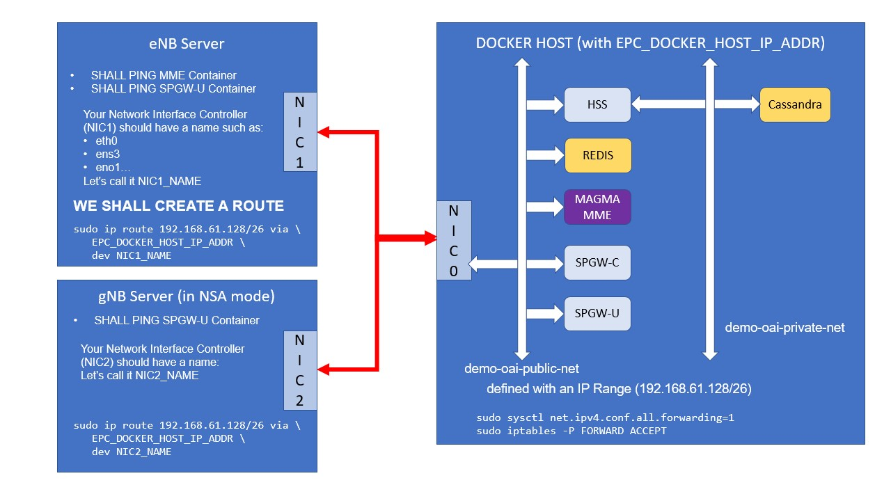

<table style="border-collapse: collapse; border: none;">
  <tr style="border-collapse: collapse; border: none;">
    <td style="border-collapse: collapse; border: none;">
      <a href="http://www.openairinterface.org/">
         
         </img>
      </a>
    </td>
    <td style="border-collapse: collapse; border: none; vertical-align: center;">
      <b><font size = "5">OpenAirInterface 支持5G-NSA的MAGMA demo</font></b>
    </td>
  </tr>
</table>


**目录**

1.  [验证所有服务器的网络连接](#1-验证所有服务器的网络连接)
    1.  [eNB 和 EPC 容器](#11-eNB-和-EPC-容器)
    2.  [gNB 和 EPC 容器](#12-gNB-和-EPC-容器)
    3.  [在eNB和gNB之间](#13-在eNB和gNB之间)
2.  [配置您自己的eNB和gNB](#2-配置您自己的eNB和gNB)

下图为我们需要做的:




# 1. 验证所有服务器的网络连接 #

## 1.1. eNB 和 EPC 容器 ##

eNB 服务器 **必须** 能访问 MME 还有 SPGW-U 容器.

Docker的 `demo-oai-public-net` 网络必须能被 eNB 服务器访问到。

我们得手动添加一条路由 (基于在 docker-compose.yml 文件中定义的子网).

```bash
$ sudo ip route add 192.168.61.128/26 via EPC_DOCKER_HOST_IP_ADDR dev NIC1_NAME
```

其中:

- EPC_DOCKER_HOST_IP_ADDR 是EPC的一堆容器 (MME、SPGW什么的) 的宿主机
- NIC1_NAME 是默认网卡名称 (可通过 `ifconfig` 查看)

用ping确认下:

```bash
$ ping -c 5 192.168.61.149
PING 192.168.61.149 (192.168.61.149) 56(84) bytes of data.
64 bytes from 192.168.61.149: icmp_seq=1 ttl=63 time=0.306 ms
64 bytes from 192.168.61.149: icmp_seq=2 ttl=63 time=0.269 ms
64 bytes from 192.168.61.149: icmp_seq=3 ttl=63 time=0.234 ms
64 bytes from 192.168.61.149: icmp_seq=4 ttl=63 time=0.266 ms
64 bytes from 192.168.61.149: icmp_seq=5 ttl=63 time=0.233 ms

--- 192.168.61.149 ping statistics ---
5 packets transmitted, 5 received, 0% packet loss, time 129ms
rtt min/avg/max/mdev = 0.233/0.261/0.306/0.032 ms
```

也可以用像 [sctp_test](https://manpages.debian.org/testing/lksctp-tools/sctp_test.1.en.html)这种工具来验证下**SCTP** 协议的连接

```bash
# 在EPC的宿主机上 (不是在EPC容器内)
$ sudo sctp_test -H EPC_DOCKER_HOST_IP_ADDR -P 36412 -l
local:addr=EPC_DOCKER_HOST_IP_ADDR, port=36412, family=2
seed = 1612270835

Starting tests...
	socket(SOCK_SEQPACKET, IPPROTO_SCTP)  ->  sk=3
	bind(sk=3, [a:EPC_DOCKER_HOST_IP_ADDR,p:36412])  --  attempt 1/10
	listen(sk=3,backlog=100)
Server: Receiving packets.
	recvmsg(sk=3) 
...
```

```bash
# 在eNB服务器上
$ sudo sctp_test -H ENB_IP_ADDR -P 36412 -h EPC_DOCKER_HOST_IP_ADDR -p 36412 -s
remote:addr=EPC_DOCKER_HOST_IP_ADDR, port=36412, family=2
local:addr=ENB_IP_ADDR, port=36412, family=2
seed = 1612271200

Starting tests...
	socket(SOCK_SEQPACKET, IPPROTO_SCTP)  ->  sk=3
	bind(sk=3, [a:192.168.18.199,p:36412])  --  attempt 1/10
Client: Sending packets.(1/10)
....
```
## 1.2. gNB 和 EPC 容器 ##

gNB服务器 **必须** 能访问到SPGW-U容器

```bash
$ sudo ip route add 192.168.61.128/26 via EPC_DOCKER_HOST_IP_ADDR dev NIC2_NAME
```

用Ping验证下:

```bash
$ ping -c 5 192.168.61.133
PING 192.168.61.133 (192.168.61.133) 56(84) bytes of data.
64 bytes from 192.168.61.133: icmp_seq=1 ttl=63 time=0.306 ms
64 bytes from 192.168.61.133: icmp_seq=2 ttl=63 time=0.269 ms
64 bytes from 192.168.61.133: icmp_seq=3 ttl=63 time=0.234 ms
64 bytes from 192.168.61.133: icmp_seq=4 ttl=63 time=0.266 ms
64 bytes from 192.168.61.133: icmp_seq=5 ttl=63 time=0.233 ms

--- 192.168.61.133 ping statistics ---
5 packets transmitted, 5 received, 0% packet loss, time 129ms
rtt min/avg/max/mdev = 0.233/0.261/0.306/0.032 ms
```

## 1.3. 在eNB和gNB之间 ##

gNB和eNB间 **必须** 能用 **SCTP** 协议访问到。

我强烈建议这样做，特别是当您使用 CentOS/RHEL 服务器作为 eNB 和 gNB 时。

```bash
# 在这种服务器上，重新启动后，我们执行以下操作：
sudo setenforce 0
sudo iptables -t nat -F
sudo iptables -t filter -F
sudo iptables -t mangle -F
sudo iptables -t raw -F
sudo iptables -t security -F
```

```bash
# 在eNB服务器上
$ sudo sctp_test -H ENB_IP_ADDR -P 36422 -l
local:addr=ENB_IP_ADDR, port=36422, family=2
seed = 1612271429

Starting tests...
	socket(SOCK_SEQPACKET, IPPROTO_SCTP)  ->  sk=3
	bind(sk=3, [a:ENB_IP_ADDR,p:36422])  --  attempt 1/10
	listen(sk=3,backlog=100)
Server: Receiving packets.
...
```

```bash
# 在gNB服务器上
$ sudo sctp_test -H GNB_IP_ADDR -P 36422 -h ENB_IP_ADDR -p 36422 -s
remote:addr=ENB_IP_ADDR, port=36422, family=2
local:addr=GNB_IP_ADDR, port=36422, family=2
seed = 1612271431

Starting tests...
	socket(SOCK_SEQPACKET, IPPROTO_SCTP)  ->  sk=3
	bind(sk=3, [a:GNB_IP_ADDR,p:36422])  --  attempt 1/10
Client: Sending packets.(1/10)
...
```

# 2. 配置您自己的eNB和gNB #

在这儿我不会解释如何编译或安装，[这里](https://gitlab.eurecom.fr/oai/openairinterface5g/-/tree/develop/doc)有很多文档供参考。

## 2.1. eNB配置文件 ##

我们用于演示的是 [OAI RAN CI for NSA FR1 setup](https://gitlab.eurecom.fr/oai/openairinterface5g/-/blob/develop/ci-scripts/conf_files/enb.band7.tm1.fr1.25PRB.usrpb210.conf)

我们做了如下修改:

我们把 eNB 的名字改了，只是个表面改动！

```bash
Active_eNBs = ( "eNB-OAI-MAGMA-NSA");

# Asn1_verbosity, 可选项: none, info, annoying
Asn1_verbosity = "none";

eNBs =
(
 {
    # real_time实时模式，可选项 {hard, rt-preempt, no}
    # hard：硬实时模式，严格的实时性要求，适用于对时间敏感的操作。
    # rt-preempt：实时抢占模式，提供较好的实时性能，但比硬实时稍微宽松一些。
    # no：非实时模式，不强制实时性要求。
    real_time       =  "no";
    ////////// Identification parameters:
    eNB_ID    =  0xe01;
    cell_type =  "CELL_MACRO_ENB"; # 小区类型
    eNB_name  =  "eNB-OAI-MAGMA-NSA";
```

更重要的是:  **MME_IP_ADDRESS**

```bash
    enable_measurement_reports = "yes";

    ////////// MME parameters:
    mme_ip_address      = ( { ipv4       = "192.168.61.149";
                              ipv6       = "192:168:30::17";
                              port       = 36412 ;
                              active     = "yes";
                              preference = "ipv4";
                            }
                          );

    ///X2
    enable_x2 = "yes";
```

**注意: `enable_measurement_reports` 和`enable_x2` 必须设置成 Yes**

## 2.2. gNB 配置文件 ##

我们还用 [OAI RAN CI for NSA FR1 setup](https://gitlab.eurecom.fr/oai/openairinterface5g/-/blob/develop/ci-scripts/conf_files/gnb.band78.tm1.fr1.106PRB.usrpb210.conf)这套配置文件

没啥改动。

## 2.3. 我们用的Tag ##

在撰写本文时采用的tag是 `2020.w51_2`，但是版本越新越好。 因为这部分内容正随着错误修复和功能增强而快速发展。

### 2021/06/17 更新 ###

我对所有教程进行了更新，并在每个组件上使用了最新的提交/标签：

组件 | 分支 | Commit | 日期
--- | --- | --- | ---
`MAGMA` | `master` | `01135cd333c51431b3fcece8ba09b2b62d6711a4` | 2021/06/13
`HSS`   | `develop` | `0e0d12e140294c7fd14fd187887e434c2273a012` | 2021/05/21
`SPGW-C` | `develop` | `b523f660ee0bc5dc06e73aba3d39c4ede65b99ab` | 2021/05/31
`SPGW-U-TINY` | `develop` | `8b39dcad77fa96edcff135a318ea3a59ed33923e` | 2021/06/01
`eNB/gNB` | `develop` | `2021.w23` | 2021/06/14

**最后:** 与录制的视频（下方链接）相比，在 2021/06/17，我使用了另一个 COTS-UE：

* 一个 **Quectel RM500Q-GL** USB流量网卡，不是智能手机。

# 3. 视频链接 #

 [Youtube：OpenAirInterface / MAGMA 5G NSA Demonstration](https://youtu.be/bnhguk6CfOk).

