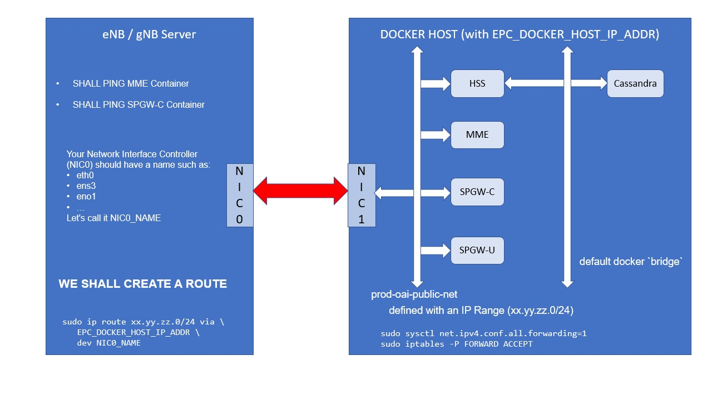

<table style="border-collapse: collapse; border: none;">
  <tr style="border-collapse: collapse; border: none;">
    <td style="border-collapse: collapse; border: none;">
      <a href="http://www.openairinterface.org/">
         
         </img>
      </a>
    </td>
    <td style="border-collapse: collapse; border: none; vertical-align: center;">
      <b><font size = "5">OpenAirInterface 核心网 Docker 部署 : 网络设置</font></b>
    </td>
  </tr>
</table>


**目录**

1.  [网络](#1-网络)
2.  [部署完成后](#2-部署完成cNF容器后)


# 1. 网络 #

从部署了 Docker 容器的服务器访问它很容易。

从另一台服务器访问 Docker 容器则不行。

下面图片表述了我们具体需要做什么：



**目标是能够从 eNB 服务器 ping MME 和 SPGW-U 容器**.


## Step 1 : 在您的 EPC docker 主机上创建一个 docker 网络 ##

只需部署 Cassandra 容器，您将创建 2 个 docker 网络：

```bash
$ cd docker-compose/magma-mme-demo
$ docker-compose up -d db_init
Creating network "demo-oai-private-net" with the default driver
Creating network "demo-oai-public-net" with the default driver
Creating demo-cassandra ... done
Creating demo-db-init   ... done
$ docker network ls
NETWORK ID          NAME                       DRIVER              SCOPE
db9d51755702        bridge                     bridge              local
c3605ce9dbf6        host                       host                local
3dffd2ec9ad2        none                       null                local
a2774c5b14ee        demo-oai-private-net       bridge              local
4a2fc2f18d63        demo-oai-public-net        bridge              local
$ docker network inspect demo-oai-public-net
[
    {
        "Name": "demo-oai-public-net",
...
        "IPAM": {
            "Driver": "default",
            "Options": null,
            "Config": [
                {
                    "Subnet": "192.168.61.128/26"
                }
            ]
        },
        "Internal": false,
        "Attachable": true,
...
    }
]
```


如您所见，公共网络(`demo-oai-public-net`)正在使用范围`192.168.61.128/26`。

如果IP地址 **不适合** 您的网络环境, 那可有得改了

## Step 2: 在您的 eNB/gNB 服务器上创建路由 ##

在 eNB 或 gNB 的服务器中，创建 IP 路由：

以下为示例。**请适应您自己的网络环境。**

```bash
# On minimassive
sudo ip route add 192.168.61.128/26 via 192.168.18.197 dev bond0

# On mozart
sudo ip route add 192.168.61.128/26 via 192.168.18.197 dev nm-bond

# On caracal
sudo ip route add 192.168.61.128/26 via 192.168.18.197 dev nm-bond
```

- 其中 `192.168.18.197` 是 **Docker Host** 的 IP 地址
- 其中 `bond0` 是 eNB 服务器（在我们的例子中为 minimassive）的 **网络接口控制器 (NIC)**。
- 其中 `nm-bond` 是 gNB 服务器（在我们的例子中为 mozart/caracal）的 **NIC**。

# 2. 部署完成cNF容器后 #

通常需要：

```bash
$ docker-compose up -d oai_spgwu
```

## 验证网络配置 ##

确保 eNB 服务器上的路由是正确的。

**在您用docker部署EPC容器的主机上:** 找到 MME 的IP:

```bash
$ docker inspect --format="{{range .NetworkSettings.Networks}}{{.IPAddress}}{{end}}" demo-magma-mme
192.168.61.149
```

您也可以在 `docker-compose.yml` 文件中找到。

**在您 eNB 服务器上:**

注：这一段说的是需要在eNB侧，ping通EPC中的 MME 和 SPGW-U

```bash
$ ping -c 5 192.168.61.149
PING 192.168.61.149 (192.168.61.149) 56(84) bytes of data.
64 bytes from 192.168.61.149: icmp_seq=1 ttl=63 time=0.306 ms
64 bytes from 192.168.61.149: icmp_seq=2 ttl=63 time=0.269 ms
64 bytes from 192.168.61.149: icmp_seq=3 ttl=63 time=0.234 ms
64 bytes from 192.168.61.149: icmp_seq=4 ttl=63 time=0.266 ms
64 bytes from 192.168.61.149: icmp_seq=5 ttl=63 time=0.233 ms

--- 192.168.61.149 ping statistics ---
5 packets transmitted, 5 received, 0% packet loss, time 129ms
rtt min/avg/max/mdev = 0.233/0.261/0.306/0.032 ms
```

对于 SPGW-U 也一样：

```bash
$ ping -c 5 192.168.61.133
...
5 packets transmitted, 5 received, 0% packet loss, time 129ms
...
```

**注意：您可以尝试 Ping HSS 容器，但是它将不起作用。**

现在可以 [生成点测试流量](./生成流量.md) 了
